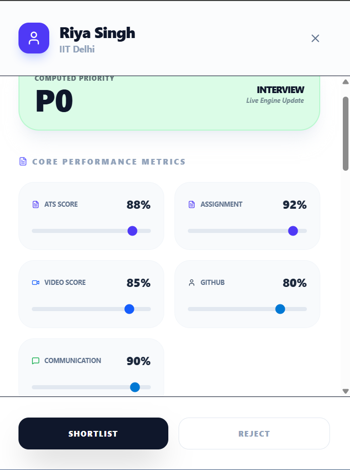
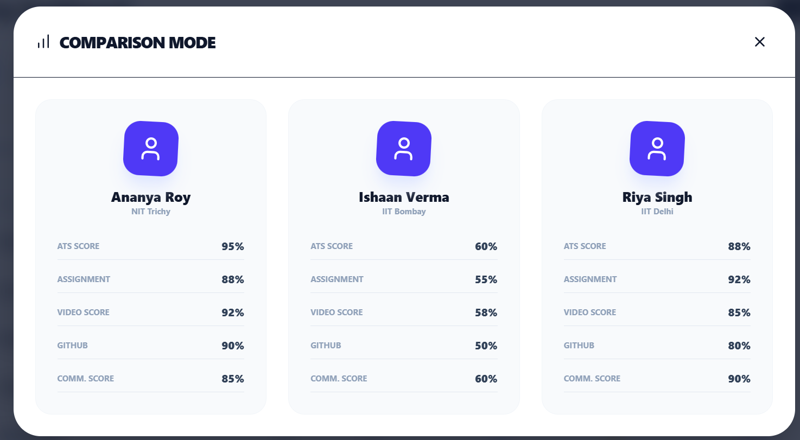
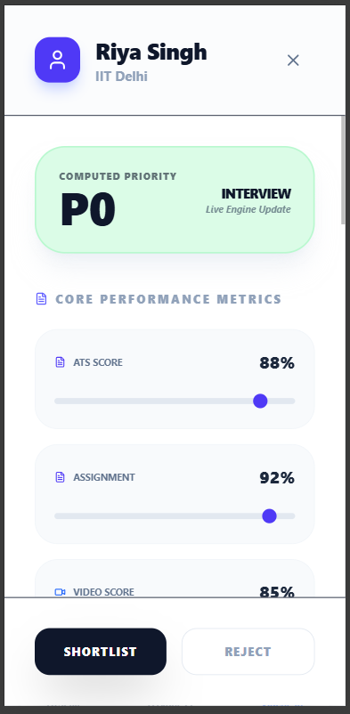

# Candidate Review Dashboard - Hiring Tool

A professional internal dashboard designed for recruiters to efficiently review, evaluate, and shortlist applicants from a pool of 1000+ candidates.

## 🔗 Project Links
- **Live Deployment:** 
- **Video Demonstration:** 
- **GitHub Repository:** 


## 🚀 Key Features
- **Candidate List Panel:** High-performance table/card layout with 50+ dummy candidates.
- **Priority Engine (Mandatory):** Automated scoring system based on weighted metrics:
  - 30% Assignment, 25% Video, 20% ATS, 15% GitHub, 10% Communication.
- **Live Updates:** Priority labels (P0 to P3) update instantly as scores are edited via sliders.
- **Advanced Filtering:** Range-based filters for Assignment and Video scores, along with Status filters.
- **Comparison Mode:** Side-by-side comparison of up to 3 candidates for better decision-making.
- **Fully Responsive:** Optimized UI for Mobile, Tablet, and Desktop screens.

## 📸 Screenshots

### 1. Main Dashboard (Desktop)


### 2. Candidate Detail Panel


### 3. Comparison Mode


### 4. Mobile Responsive View


## 🛠️ Tech Stack
- **Frontend:** React.js, Tailwind CSS
- **Icons:** Lucide-React
- **Animations:** Framer Motion
- **Deployment:** Vercel / Netlify

  ## 🎨 Creative UI/UX Choices

- **Priority Color Coding:** Implemented a high-contrast color system (Green to Red) for P0-P3 levels, allowing recruiters to visually scan and identify top talent instantly.
- **Responsive Layout Switching:** Instead of forcing a horizontal scroll on mobile, the dashboard automatically transitions from a complex Table view to a simplified Card view for better usability.
- **Progressive Disclosure:** Used a Side Drawer for candidate details and evaluations. This keeps the main dashboard clean and focused while providing deep-dive capabilities without losing context.
- **Interactive Evaluation:** Sliders provide immediate visual feedback. As soon as a score is adjusted, the priority badge and stats update in real-time, simulating a highly reactive professional tool.

## 💾 State Management & Persistence

- **State Management:** Utilized React Hooks (`useState`, `useEffect`) for core logic. Used `useMemo` extensively to handle complex filtering and sorting of 50+ candidates efficiently without unnecessary re-renders.
- **Lifting State Up:** The candidate data is managed at the `App.jsx` level. This ensures that when a recruiter updates a score in the `CandidateDrawer`, the changes are instantly reflected in the `CandidateTable` and `StatsHeader`.
- **Data Persistence:** Integrated `localStorage` to ensure that reviewer evaluations (ratings and notes) are saved locally. This prevents data loss during browser refreshes or accidental tab closures.
- **Weighted Logic:** Implemented a custom Priority Engine that dynamically calculates scores based on assignment-specific weightage (30% Assignment, 25% Video, etc.).

## 💻 Setup & Run Instructions

Follow these steps to run the project locally:

1. **Clone the repository:**
   ```bash
   git clone https://github.com/Prerna-Singh-90/Candidate-Review-Dashboard.git
2. **Navigate to Directory:**
   ```Bash
   cd candidate-review-dashboard
3. **Install Dependencies:**
    ```Bash
   npm install
4. **Run the Project:**
   ```Bash
   npm run dev

   Now, open http://localhost:5173 in your browser.

 ## 🏗️ Folder Structure
- **src/components/Dashboard:** Stats, Filters, and Main Table.
- **src/components/DetailPanel:** Candidate Drawer, Evaluation Sliders and Video Evaluation.
- **src/components/Comparison:** Side-by-side Comparison Modal.
- **src/utils:** Priority calculation logic.
- **src/data:** Local JSON dummy dataset.

  ## 👩‍💻 Author
Prerna Frontend Developer
